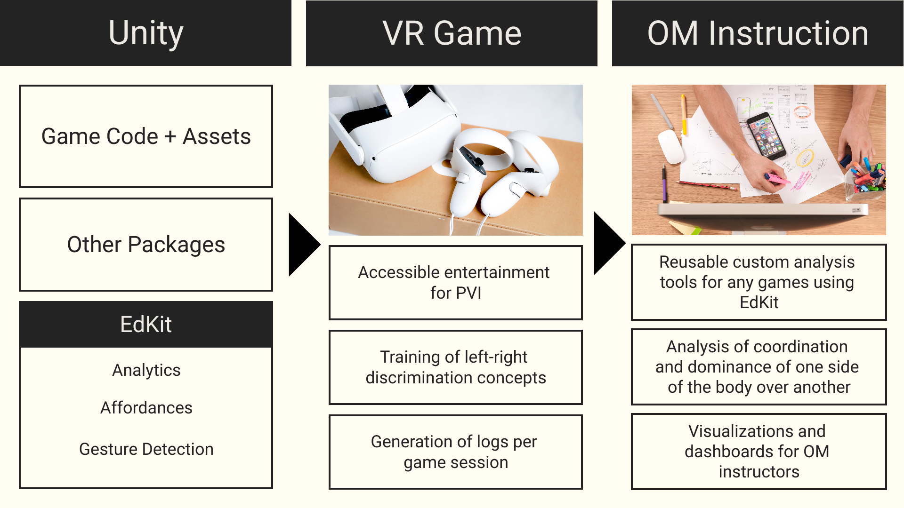
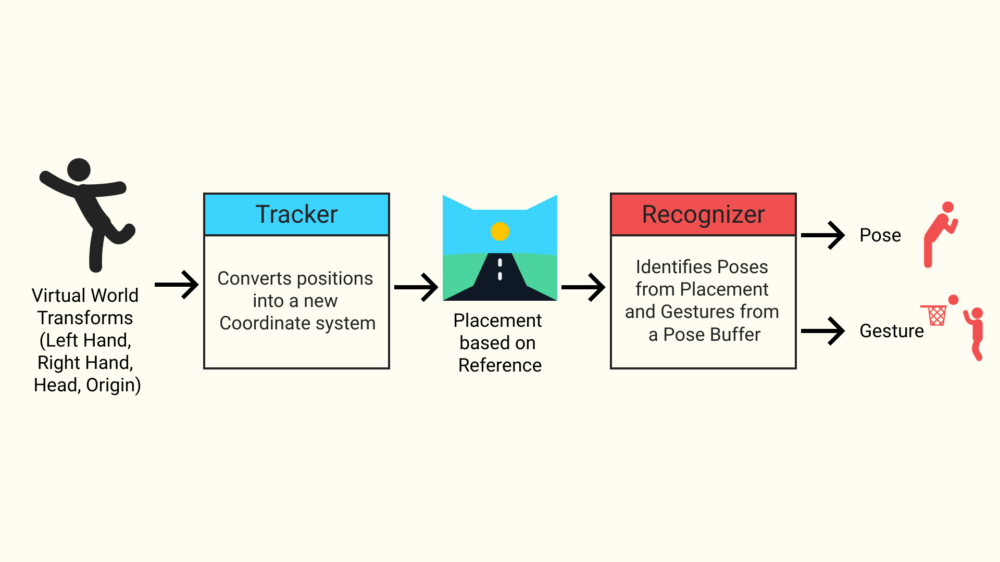
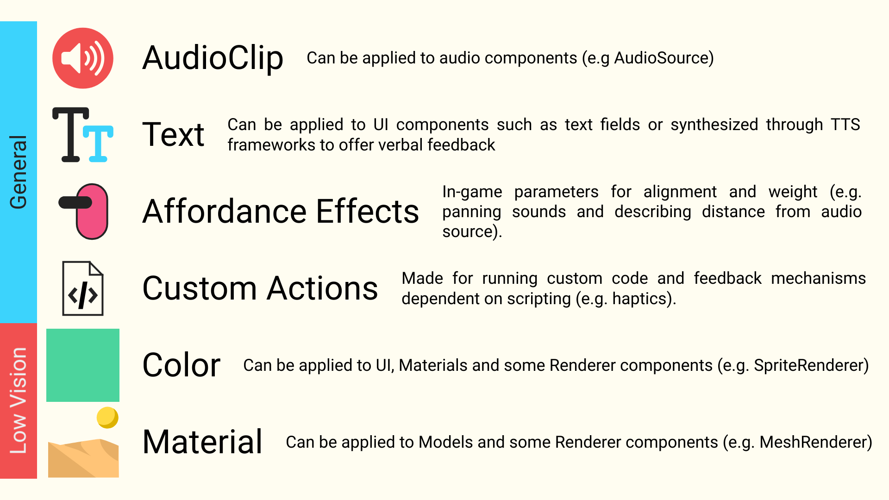
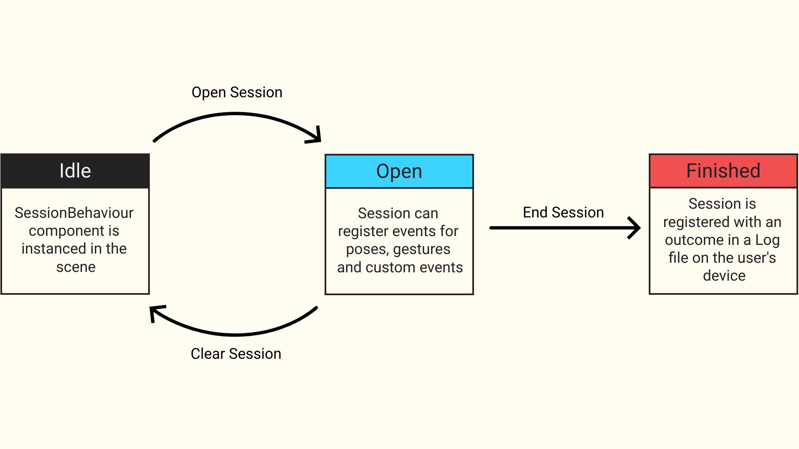

# EdKit

EdKit is a custom Unity package that aids in the development of VR games for People with Visual Impairments (PVI) that work with Left-Right discrimination concepts, an useful spatial orientation concept that allows further development of their cognitive and motor skills.

## How to Install

Via Unity Package Manager:

1. In Unity, go to "Window" -> "Package Manager"
2. Click the + button, and select "Add package from git URL..."
3. Enter the URL of this repository:
    - <https://github.com/MartonioJunior/EdKit.git>

## Features

The package offers an abstraction layer that combines Player Gestures, Affordances and Analytics by using basic Unity structures as a scripting-free way to use this package in your game at the cost of limited functionality. On the other hand, Scripting allows you deeper customization for implementing poses and gestures while still maintaining compatibility with the package's custom components.

### Player Gestures

For the gesture model, basic structures were created to encapsule position and orientation references for objects in a new coordinate system that's based on the egocentric reference generated by `TrackerBehaviour`, which uses 4 reference Transforms:

- Head (or the actor's body)
- Left Hand (or equivalent)
- Right Hand (or equivalent)
- The actor's respective origin (e.g. XR Origin)

`TrackerBehaviour` generates a new `Placement` structure, containing orientations for the head and hands. The `Orientation` for each element is composed of a `Position` and a `Rotation` structures, which are encapsulations that add new utility methods for comparisons based on an Axis, simplifying the identification process for left/right, above/below, front/back while also having a deadzone area for the spatial reference.

Poses can process `Placement` objects and give a score based on how precise the Placement is to itself, while Gestures uses a list of poses in it's scoring process. Both of these are part of `RecognizerBehaviour`'s implementation, which receives a `Placement` and fires events after identifying a pose (`onPoseRecognized`) or a gesture (`onGestureRecognized`)

To describe a new pose, you can:

- Via Scripting: Create a new instance of `Pose` or conform to the `IPose` interface and define the criteria for how `Placement` should be evaluated.
- Via Editor: Create a new `PoseData` Scriptable Object, defining manuals the bounds for each orientation.

As for a new gesture, the options are:

- Via Scripting: Create a new instance of `Gesture` or conform to the `IGesture` interface and define the crita for how the sequence of poses should be evaluated.
- Via Editor: Create a new `PoseData` Scriptable Object, setting a list of `PoseData` elements in order to define a new gesture.

To use Gesture Recognition:

1. Create a new `GameObject` with the `TrackerBehaviour` and `RecognizerBehaviour` components.
2. Connect `RecognizerBehaviour.Register` method to `onUpdatePlacement` event of `TrackerBehaviour`
3. Assign the Transforms for all 4 references.
4. Create a new component to seed the gestures and poses tracked by the `RecognizerBehaviour` via the `SetPoses` and `SetGestures` methods (it's recommended to declare a variable for the `RecognizerBehaviour` so it can be assigned directly during Awake/Start).
5. Add this new seeder component to a GameObject and assign the `RecognizerBehaviour` to this new component.

### Multimodal Feedback

For the feedback system, we have a structure based on Affordances: a representation of multimodal feedback in the game that is applied simultaneously through different channels, which can include:

Affordances can be applied via an `AffordanceBehaviour`, which is responsible for getting the representations of the Affordance and firing events for each representation.

To create a new affordance, you can:

- Via Scripting: Create a new instance of `Affordance` or conform to the `IAffordance` interface and define which elements should be returned.
- Via Editor: Create a new `AffordanceData` Scriptable Object and define each feedback type manually.

To use Affordances:

1. Add a new `GameObject` with an `AffordanceBehaviour` component.
2. Wire each event to it's respective listeners.

### Game Analytics

For tracking game events to build the Analytics model, the package takes advantage of JSON serialization to store pose events and gesture events, as well as any serializable type as a custom event. Everything is stored into `Session`, which also contains information about the date and time when the game session was played, the user who played it, in which scene this happened and the outcome of the session.

This model is managed by `SessionBehaviour`: a MonoBehaviour component responsible for managing the lifecycle of a session: To start, the developer opens a session, passing identifiers for the user and scene. Then, events are registered using any of the methods declared. When the session ends, the developers closes the session with the session's outcome, which then gets saved into a log file that's stored on the player's device and can be extracted and interpreted by custom tools, such as dashboard visualizations.

To use Game Analytics:

1. Create a new `GameObject` with a `SessionBehaviour` component.
2. Assign the component to any reference field or `UnityEvent` reference to call it's methods.

## Considerations

This package is still a work-in-progress and the API may have breaking changes until it reaches stability, so use it at your own discretion.
